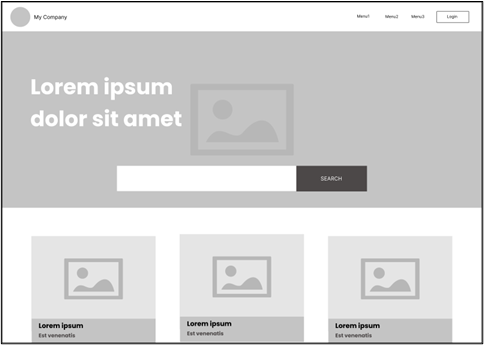
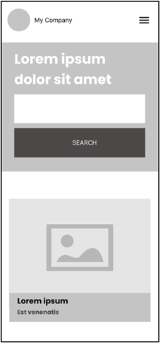

# Welcome to **Mission Zero** 🚀

**You are contracted by Marketing Association New Zealand to build a quick page as a template for their new digital news home page.**

### 🤓 The Project Brief:

You will need to create 1 page with a mobile responsive layout.
**Below are the requirements:**

- Build an application using any front-end framework of your choice with a home page using the wireframe shared as guidance.

- You can use your own color palette and pictures.

- Search functionality need not be implemented.

### 🧩 Wireframe Reference


Make the webpage responsive using the wireframe below as guidance.



### 🛠️ Tech Stack

- React + Vite
- Tailwind CSS

### 📝 Notes

- This is a prototype; most layout and logic are currently in `App.jsx`.
- Layout structure, card grid, and responsive logic are scaffolded in `App.jsx`.
- Tailwind classes handle spacing, typography, and breakpoints.

### 🚀 Getting Started

```bash
npm install
npm run dev
```
